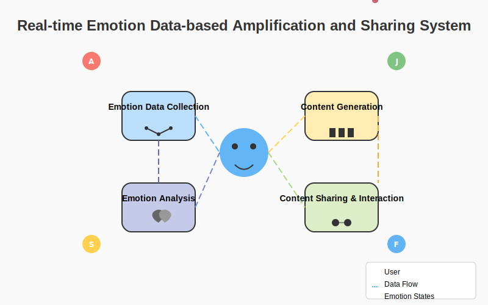

# EmotionAmplifier: Real-time Emotion Data-based Amplification and Sharing System

A comprehensive system that collects real-time emotional data through multiple sensors, analyzes it using advanced AI techniques, generates personalized emotion-amplifying content, and enables emotional sharing in a secure environment.

## Table of Contents

- [Overview](#overview)
- [System Architecture](#system-architecture)
- [Key Features](#key-features)
- [Components](#components)
  - [Emotion Data Collection](#emotion-data-collection)
  - [Emotion Analysis](#emotion-analysis)
  - [Emotion Amplification Content Generation](#emotion-amplification-content-generation)
  - [Content Sharing and Social Interaction](#content-sharing-and-social-interaction)
- [Technical Innovations](#technical-innovations)
- [Applications](#applications)
- [Simulation](#simulation)

## Overview

The EmotionAmplifier system uses real-time biometric data including frequency-scanned bioimpedance measurements to accurately detect and analyze emotional states. It then generates personalized content to amplify or modulate these emotions and facilitates sharing of emotional experiences between users, creating deeper connections and improving mental well-being.

## System Architecture

The system consists of four primary modules that work together to create a seamless emotional experience:

1. **Emotion Data Collection**: Gathers physiological data through various sensors and user inputs
2. **Emotion Analysis**: Processes collected data to determine emotional states using deep learning techniques
3. **Emotion Amplification Content Generation**: Creates personalized multimedia content tailored to the user's emotional state
4. **Content Sharing and Social Interaction**: Enables users to share emotional experiences and connect with others

## Key Features

- **Multi-sensor fusion** for comprehensive emotion detection (heart rate, EEG, skin conductance, frequency-scanned bioimpedance)
- **Deep learning-based emotion analysis** utilizing multimodal LSTM networks for accurate emotion classification
- **Hybrid generative models** (GAN + VAE) for creating personalized emotion-amplifying content
- **Blockchain-backed emotional sharing platform** for secure and private emotional connections
- **Emotion synchronization algorithms** to match users with compatible emotional states
- **Mental health tracking** and analysis for long-term emotional well-being

## Components

### Emotion Data Collection

The system employs multiple sensors and data collection methods to gather comprehensive emotional data:

- **Physiological Data**:
  - Heart rate and heart rate variability (HRV)
  - Brain wave patterns (EEG)
  - Skin conductance (GSR)
  - Body temperature
  - Facial expressions via computer vision
  - Voice analysis
  - **Frequency-scanned bioimpedance measurements** (proprietary technology)

- **User Input Data**:
  - Self-reported emotional states
  - Preferences and interests
  - Emotional goals

The data collection module uses wearable devices (smartwatches, headbands) and smartphone sensors, with a focus on non-invasive and comfortable continuous monitoring.

### Emotion Analysis

The collected data undergoes sophisticated processing to identify emotional states:

- **Data Preprocessing**: Normalizes and integrates different types of sensor data
- **Feature Extraction**: Identifies relevant patterns and features from raw signals
- **Multimodal LSTM Network**: Analyzes time-series data from multiple sources
- **Emotion Classification**: Categorizes emotions with intensity scores (Joy, Trust, Fear, Surprise, Sadness, Disgust, Anger, Anticipation)
- **Personalized Emotion Model**: Continuously learns and adapts to individual emotional patterns

The system can detect subtle emotional nuances and context-specific emotional responses, going beyond basic emotion classification.

### Emotion Amplification Content Generation

Based on the analyzed emotional state, the system generates personalized content to amplify or modulate emotions:

- **Hybrid Generative Model**:
  - **Generative Adversarial Network (GAN)** for high-quality visual and audio content
  - **Variational Autoencoder (VAE)** for structured emotional representation

- **Content Types**:
  - Visual (images, animations, color schemes)
  - Audio (music, ambient sounds)
  - Text (affirmations, stories, poetry)
  - Haptic feedback patterns

- **Personalization Factors**:
  - Current emotional state
  - Personal preferences
  - Historical content effectiveness
  - Emotional goals

The content generation adapts in real-time based on user feedback and physiological responses.

### Content Sharing and Social Interaction

The system enables users to share emotional states and generated content with others:

- **Emotion Matching**: Connects users with compatible emotional states
- **Content Sharing**: Allows sharing of generated emotional content
- **Group Emotional Experiences**: Facilitates collective emotional activities
- **Emotional Feedback**: Provides responses to shared emotional content
- **Blockchain Security**: Protects emotional data ownership and privacy

The platform creates meaningful emotional connections while maintaining privacy and data security.

## Technical Innovations

1. **Multi-sensor fusion and multimodal deep learning**: Integrates diverse emotional data sources for unprecedented accuracy in emotion detection.

2. **Frequency-scanned bioimpedance analysis**: Captures subtle neurological responses related to emotional states through proprietary signal processing.

3. **Hybrid GAN-VAE architecture**: Combines the creative potential of GANs with the structured representation of VAEs for optimal emotion-based content generation.

4. **Emotion synchronization algorithms**: Novel approach to match users based on emotional compatibility and facilitate meaningful connections.

5. **Blockchain-based emotional data management**: Secures user data while enabling selective sharing of emotional experiences.

## Applications

The EmotionAmplifier system has applications across multiple domains:

- **Mental Health**: Emotion tracking, stress management, mood enhancement
- **Entertainment**: Emotionally responsive content, immersive experiences
- **Social Media**: Deeper emotional connections between users
- **Education**: Emotion-optimized learning environments
- **Healthcare**: Emotional well-being monitoring and intervention
- **Marketing**: Emotionally resonant customer experiences

## Simulation

Try out a simulated version of the EmotionAmplifier system:

1. Visit the [simulation page](deployment/simulation/index.html)
2. Input sample physiological data or use one of our pre-defined emotional profiles
3. Observe the generated emotion-amplifying content and social matching features

*Patent Pending*
